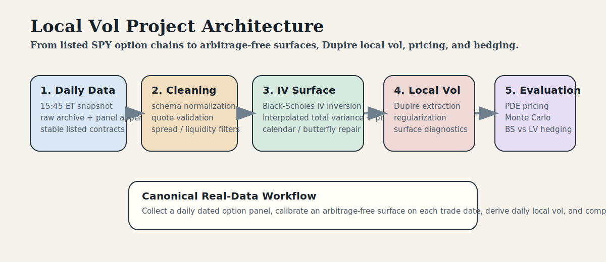
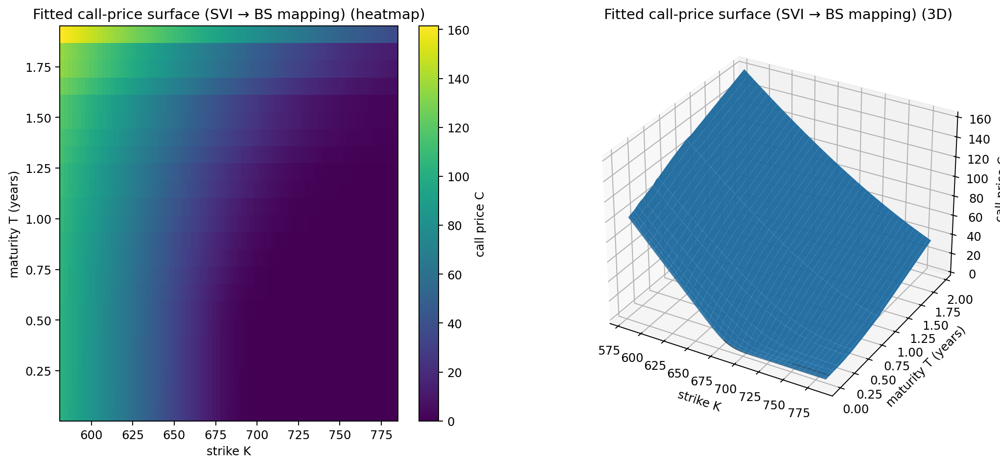
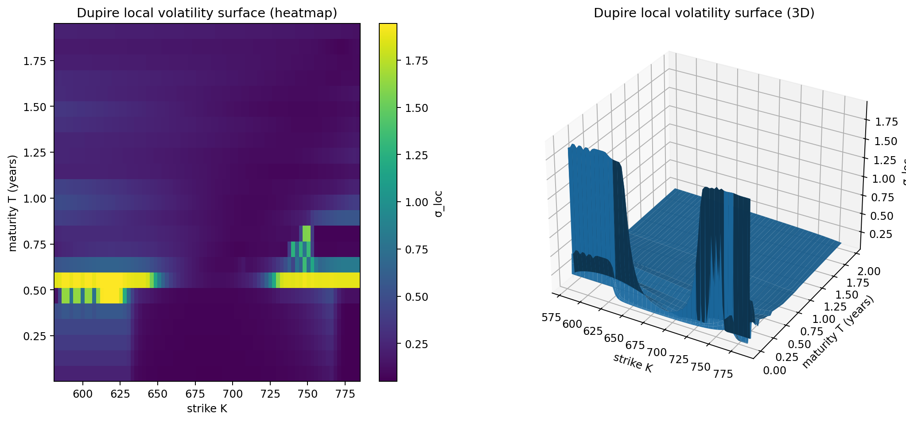
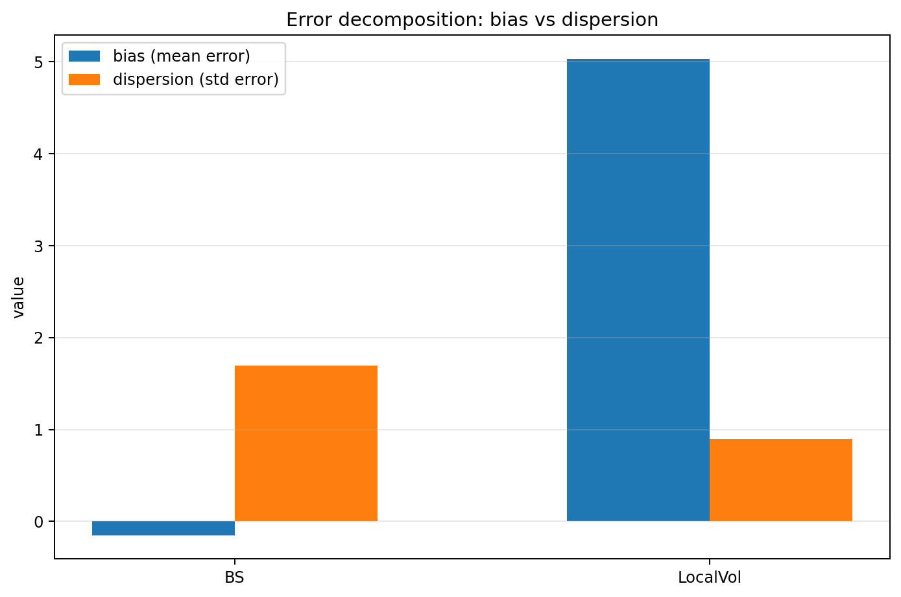

# Arbitrage-Free IV Surface to Dupire Local Vol for Pricing and Hedging

[](pyproject.toml)
[](LICENSE)
[](.github/workflows/ci.yml)

This repository builds an end-to-end options modeling workflow for listed SPY options. It collects daily option-chain snapshots, constructs an arbitrage-free implied-volatility surface, derives Dupire local volatility, prices with Crank-Nicolson PDE and Monte Carlo, and evaluates Black-Scholes versus Local Vol hedging with transaction costs on fixed listed contracts.



## Overview

- Daily SPY option-chain collection at `15:45` America/New_York
- Synthetic call surface built from OTM puts and OTM calls
- Static-arbitrage repair in call-price space
- Dupire local-vol extraction with explicit trusted-domain handling
- Numerical pricing with PDE and Monte Carlo
- Dated-panel hedge study with explicit transaction costs

## Current Status

The canonical workflow uses Theta option-chain data. A small Yahoo fallback remains only for SPY spot and carry inputs because the selected Theta plan does not include the stock-side historical quote bundle.

| Item | Value |
| --- | ---: |
| Panel snapshots | `22` |
| Panel date range | `2026-02-18` to `2026-03-19` |
| Hedge-study contracts | `10` |
| Final arbitrage failures after projection | `0` |
| Weighted fit inside bid/ask | `9.78%` |
| Trusted-domain repricing MAE | `2.2638` |
| BS pricing RMSE | `0.1888` |
| Local Vol pricing RMSE | `1.4566` |
| BS replication net RMSE | `2.2176` |
| Local Vol replication net RMSE | `2.6675` |
| BS net market-PnL RMSE | `2.1460` |
| Local Vol net market-PnL RMSE | `1.7217` |
| Test suite | `81 passed` |

## Pipeline

The project starts from listed quotes and turns them into pricing and hedging objects:

1. collect one full SPY option snapshot per trading day,
2. standardize and validate the chain,
3. merge OTM puts and OTM calls into a synthetic call dataset,
4. fit a direct total-variance surface in strike and maturity,
5. project the call-price grid onto the static no-arbitrage set,
6. derive an arbitrage-free IV surface and a Dupire local-vol surface,
7. price options numerically with PDE and Monte Carlo,
8. evaluate Black-Scholes and Local Vol on a dated historical panel of listed contracts.

The canonical workflow focuses on the liquid short-dated SPY core rather than trying to force an equally strong fit across the entire listed chain.

## Quickstart

Install dependencies and run the test suite:

```powershell
poetry install
poetry run pytest -q
```

Run the local demo:

```powershell
poetry run python scripts\demo_snapshot_pipeline.py
```

Run the canonical daily workflow:

```powershell
poetry run python scripts\run_canonical_daily_update.py
```

## Main Entry Points

- [run_canonical_daily_update.py](scripts/run_canonical_daily_update.py)  
  Collects the daily snapshot, appends the panel, recalibrates, reruns the hedge study, and regenerates the canonical report.
- [run_snapshot_calibration.py](scripts/run_snapshot_calibration.py)  
  Runs a single-date calibration from either a local snapshot file or a live fetch.
- [run_backtest_market_panel.py](scripts/run_backtest_market_panel.py)  
  Runs the historical hedge study on the dated option panel.
- [backfill_theta_option_panel.py](scripts/backfill_theta_option_panel.py)  
  Backfills historical `15:45` Theta snapshots into the canonical panel.
- [generate_report.py](scripts/generate_report.py)  
  Generates the markdown report and figures from the latest artifacts.

## Documentation

- [Project Summary](docs/project_summary.md)
- [System Architecture](docs/system_architecture.md)
- [Data Workflow](docs/data_workflow.md)
- [Findings](docs/findings.md)
- [Reference Outputs](docs/reference_outputs/README.md)
- [Canonical Daily Config](config/daily_collection.yaml)

## Notebook Reading Order

1. [01_data_exploration.ipynb](notebooks/01_data_exploration.ipynb)
2. [02_iv_surface_fitting.ipynb](notebooks/02_iv_surface_fitting.ipynb)
3. [03_local_vol_extraction.ipynb](notebooks/03_local_vol_extraction.ipynb)
4. [04_pricing_validation.ipynb](notebooks/04_pricing_validation.ipynb)
5. [05_hedging_backtest.ipynb](notebooks/05_hedging_backtest.ipynb)

Together they walk through raw option data quality, surface fitting and arbitrage repair, Dupire local volatility, pricing validation, and the dated hedge-study design.

## Representative Figures

Projected arbitrage-repaired call surface:



Regularized Dupire local-vol surface:



Hedge-study error decomposition:



## Repository Layout

### `src/`

Reusable library code:

- `market_data/` for vendor loaders, transforms, validation, carry estimation, and panel storage
- `surface_fitting/` for total-variance interpolation
- `arbitrage/` for static-arbitrage checks, projection, and density diagnostics
- `local_volatility/` for Dupire extraction and regularization
- `pricing/` for PDE, Monte Carlo, and Greeks
- `hedging/` for daily market-panel backtesting and transaction-cost logic
- `pipeline/` for reusable single-snapshot calibration

### `scripts/`

Operational entry points for collection, calibration, backfill, reporting, and scheduled execution.

### `config/`

Canonical daily settings live in:

- [daily_collection.yaml](config/daily_collection.yaml)
- [realdata_backtest.yaml](config/realdata_backtest.yaml)

## Canonical Daily Workflow

1. collect one full SPY snapshot at `15:45`,
2. archive it,
3. append it into the panel,
4. recalibrate the surface for that date,
5. rerun the short-dated hedge study on fixed listed contracts,
6. regenerate the canonical report in `output/canonical_daily`.

On Windows, the scheduled task installer is:

```powershell
python scripts\install_windows_daily_snapshot_task.py --force
```

That task runs `scripts/run_canonical_daily_update.py` each trading day at `15:45` local machine time.

## Current Limitations

- the stock-side inputs still rely on a small Yahoo fallback,
- local volatility remains a deterministic volatility model,
- density mass is measured on a finite strike grid,
- and the daily panel becomes more informative as more dates accumulate.

## Tests

```powershell
poetry run pytest -q
```

The suite covers calibration, arbitrage projection, Dupire extraction, PDE and Monte Carlo consistency, daily collection helpers, panel backtesting, and scheduled-task command generation.
